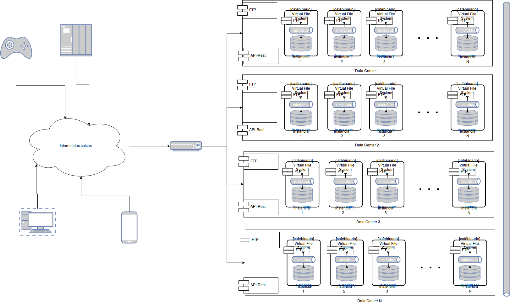

## [cafébinario] :: FileSystem

Sistemas de Arquivo em memória (Java 7 NIO) distribuido, clusterizado, com auto-descobrimento, balanceamento de carga e proxy-reverso entre os nós.

Escalavel verticalmente e horizontalente, permite replicação de dados em tempo real entre diversos data-centers.

Alta-perfomance e alta-disponibilidade para arquivos.

Interface Rest e FTP.

Permite pesquisa com palavras chaves e parte de conteudo multi-midia.

